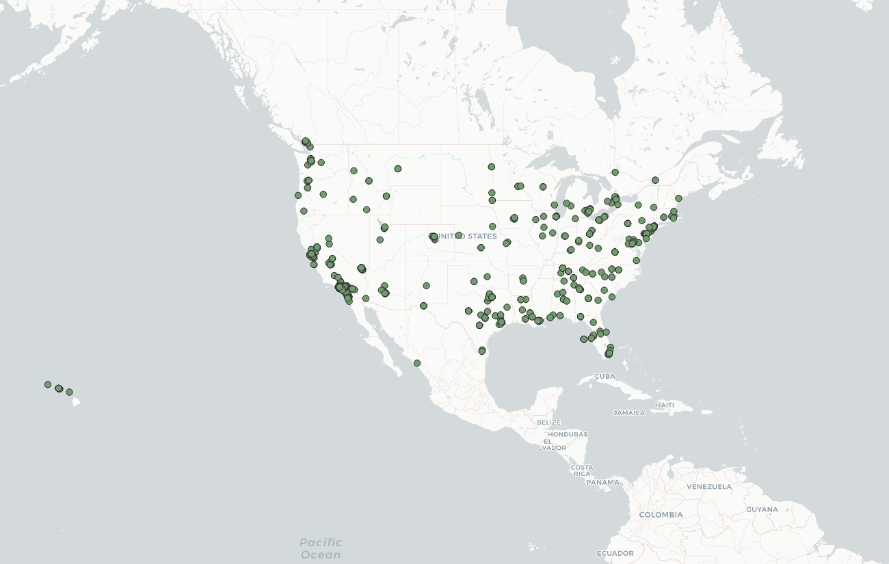
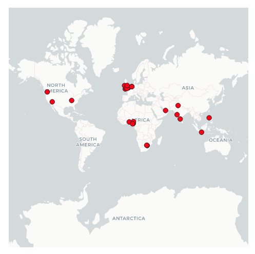

# Jasmine Palaganas
# April 26, 2022
# Lab 2: Creating visualizations using geo-tagged tweet collection through the Twitter API.

## Introduction
I utilized the Twitter API to gather location-based tweets made in real-time. For the first iteration, I edited the parameters to reflect tweets created at around 11:00 pm Pacific Standard Time on April 25, 2022 with its location based solely in the United States. 

In the second iteration I focused on tweets mentioning "Elon Musk" due to the name's current fast-growing popularity. He has recently bought the Twitter corporation for about 44 billion dollars, so Elon Musk has become a trending topic in the last couple of days. This collection was performed at around 2:00 am Pacific Standard Time on April 26, 2022. I widened the search to include tweets created anywhere in the world. 

I was interested in exploring the volume and general emotions of tweets about varying subjects when taking into consideration, the time of day, search queries, and location. 

## Tweets in the US

This map has many more data points due to the time it was created (earlier in the day) and with no other filters besides location. I did not prompt to search for any specific text entry in the parameters of the filter function. 

## Map of Tweets Where "Elon Musk" is Mentioned

This map has significantly less data points than the map depicting tweets in the U.S. Since the data was gathered at (what I suspect is an) unpopular time of the day, it produced much less results. I would predict that a search with these same parameters ocurring during the middle of the day would find many more search results. However, with this map we can gain an understanding of the production of tweets from accross the world and where Twitter may be popularly used during this time of day. 

## Word Cloud Depicting US Tweets

At first glance, we might wonder why such an odd character is the most popularly used word in this collection of tweets. Upon research, I found out that "Ðÿ" represents an emoji that cannot be represented in basic text on a .csv file. Emojis are commonly used on social media apps so I can understand why such odd characters appear so often on this word cloud. 

## Word Cloud Depicting "Elon Musk" Related Tweets

This word cloud is much easier to decipher because we are exploring a specific term. However, we can still see odd characters representing potential emojis being used within the tweet. Terms like "money", "rich", and "business man" are phrases that we can associate with Elon Musk so I am not surprised they appear fairly large on this word cloud. 